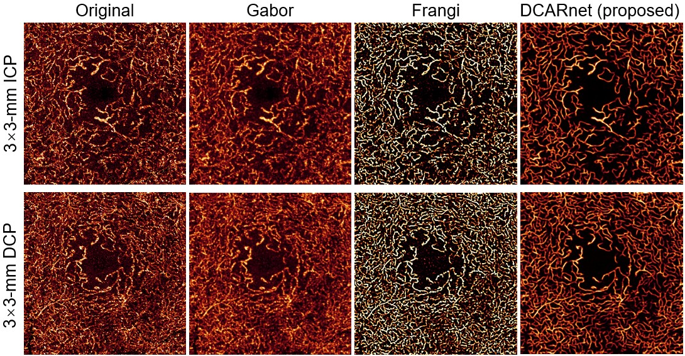

# An open-source deep learning network for the reconstruction of high-resolution OCT angiograms of retinal intermediate and deep capillary plexuses  

[ [**OCTAngio Home Page**](https://octangio.github.io/) ] 

By [**Min Gao**](https://scholar.google.com/citations?user=T1vzVnYAAAAJ&hl=en),  [**Tristan T.Hormel**](https://scholar.google.com/citations?user=jdD1rGwAAAAJ&hl=en), [**Jie Wang**](https://scholar.google.com/citations?user=DoIwLN0AAAAJ&hl=en), [**Yukun Guo**](https://scholar.google.com/citations?user=BCrQPWUAAAAJ&hl=en&oi=sra), [**Steven T. Bailey**](https://www.researchgate.net/profile/Steven-Bailey-10), [**Thomas S. Hwang**](https://www.researchgate.net/profile/Thomas-Hwang-2), [**Yali Jia**](https://scholar.google.com/citations?user=hfBY5K8AAAAJ&hl=en&oi=sra)

This repo is the official implementation of "An open-source deep learning network for the reconstruction of high-resolution OCT angiograms of retinal intermediate and deep capillary plexuses".

## Introduction

We proposed a deep-learning based method, which receives inputs from registered 3×3-mm ICP and DCP angiograms with proper sampling density as the ground truth reference to reconstruct 6×6-mm high-resolution ICP and DCP en face OCTA. We applied the same network on 3×3-mm angiograms to enhance these images further. We evaluated the reconstructed 3×3- and 6×6-mm angiograms based on vessel connectivity, Weber contrast, false flow signal (flow signal erroneously generated from background), and the noise intensity in the foveal avascular zone (FAZ). Compared to the originals, the DCARnet-enhanced 6×6-mm angiograms had significantly reduced noise intensity, improved vascular connectivity, enhanced Weber contrast, without generating false flow signal when noise intensity lower than 650. The DCARnet-enhanced 3×3-mm angiograms also reduced noise, improved connectivity, and enhanced Weber contrast in 3×3-mm ICP and DCP angiograms. In addition, DCARnet preserved the appearance of the dilated vessels in the reconstructed angiograms in diabetic eyes.

#### Figure 1. Algorithm flowchart.


## Getting Started

### Clone our repo

```bash
git clone git@github.com:octangio/DCARnet.git
cd DCARnet
```

### Install packages

  ```bash
  pip install -r requirements.txt
  ```
  The software version we used is DCARnet_1.0.

### Train model on your own data

- prepare data

  The image normalization range from 0 to 255.  
  The data set folder should be like the following structure.

    ```tex
    dataset
    |
    |-- image
    |   |
    |   |- image_0001.png
    |   |- image_0002.png
    |   |- ...
    |
    `-- label
        |
        |- label_0001.png
        |- label_0002.png
        |- ...
    ```
Then you need to generate the path list of image and label. 

- Training
  
  ```bash
   python my_train.py --train_image=./dataset/train_image/_list.txt --train_label=./dataset/train_label/_list.txt --valid_image=./dataset/valid_image/_list.txt --valid_label=./dataset/valid_label/_list.txt --batch_size=128
  ```
### Test

   The lateral resolution is 9.87μm. The axial resolution is 3μm. You need to convert to the same resolution and then use our model to test.
 
   ```bash
   python predict_results.py --test_data_path=./dataset/test_data --save_path=./dataset/output_results --logdir=./logs/saved_model.hdf5 --resize_width=608 --resize_height=608
   ```

### Results
  #### Figure 2. DCARnet's outputs on 3x3-mm ICP and DCP angiograms. 
  
  
  
  #### Figure 3. DCARnet's outputs on 6x6-mm ICP and DCP angiograms. 
  
    
